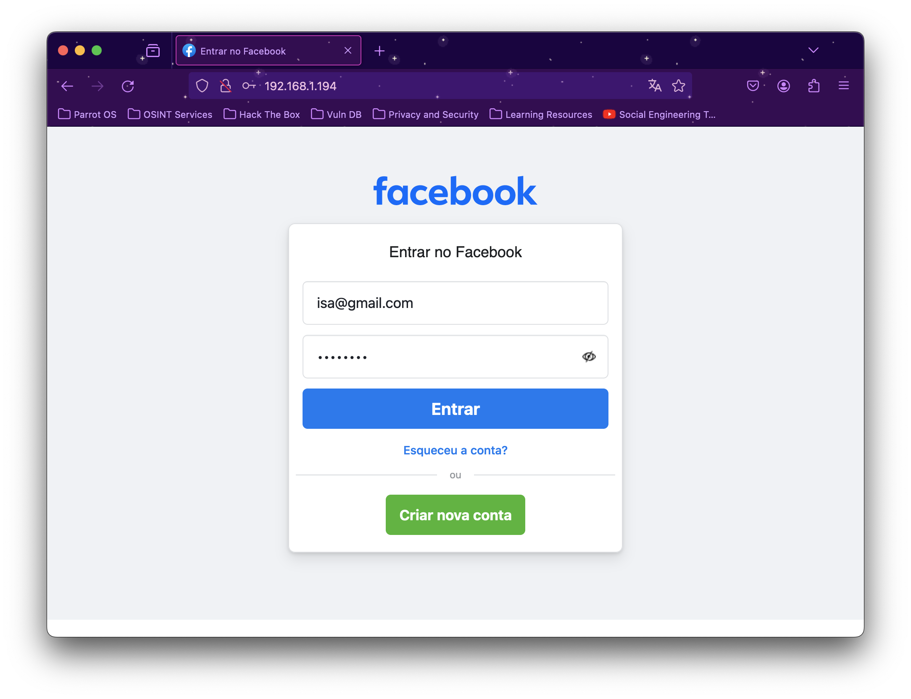

# Phishing para captura de senhas do Facebook

## Ferramentas

VirtualBox

Parrot Security

Python 3

setoolkit
## Configurando o Phishing no Parrot Security


Instalando dependências

```bash
  sudo apt-get install python3
```


```bash
  sudo apt install python3-pip  
```


```bash
  pip3 install ptyprocess 
```

```bash
   pip3 install pexpect 
```

Clonado o projeto

```bash
  git clone https://github.com/trustedsec/social-engineer-toolkit
```

Acessando o diretório do projeto clonado 

```bash
  cd Downloads
```

```bash
  cd setoolkit
```

Instalado Requisitos

```bash
  pip3 install -r requirements.txt
```

```bash
  python setup.py
```

Executando o Phishing

Acesso root:  

```bash
  sudo su
```

Iniciando o setoolkit: 

```bash
  setoolkit
```

Tipo de ataque: 

```bash
  1 - Social-Engineering Attacks
```

Vetor de ataque:

```bash
  2 - Web Site Attack Vectors
```

Método de ataque

```bash
  3 - Credential Harvester Attack Method
```

Método de ataque: 

```bash
  2 - Site Cloner
```

Obtendo o endereço da máquina:

```bash
  ifconfig
```

URL para clone: 

```bash
  http://www.facebook.com/
```


## Resutados



